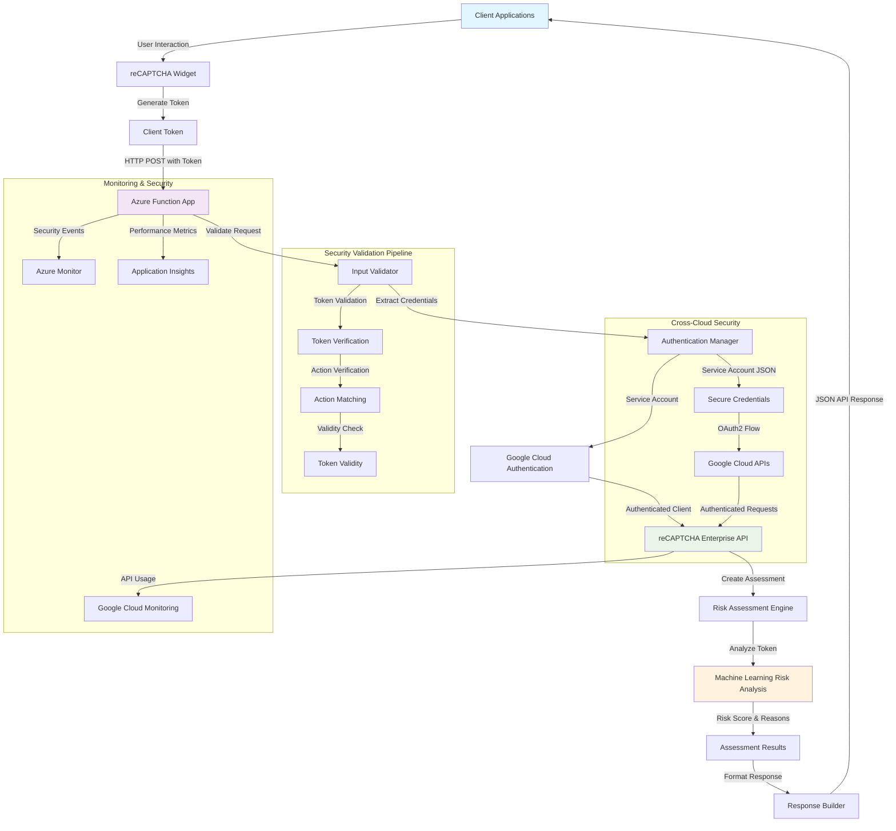
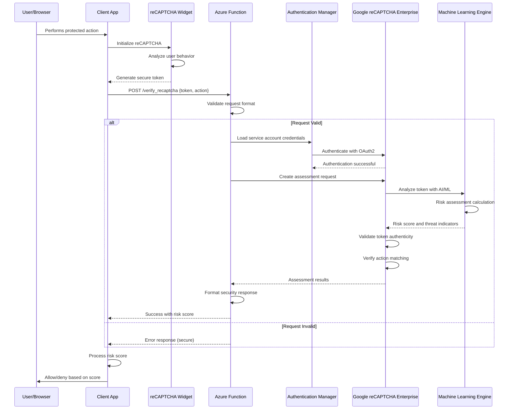
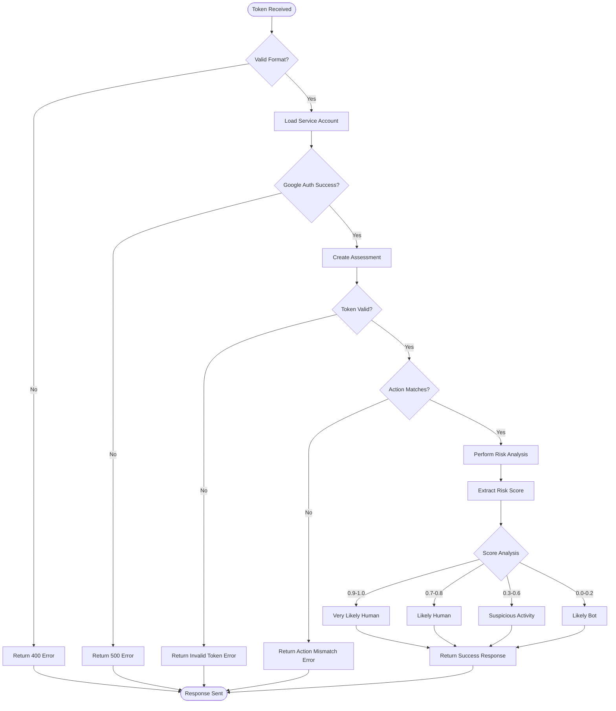

# 🏗️ reCAPTCHA Enterprise Function App Architecture

## 📖 Overview

This document describes the comprehensive architecture of the reCAPTCHA Enterprise Function App, a sophisticated serverless security system that integrates Azure Functions with Google Cloud's enterprise-grade bot protection service. The system implements advanced threat detection, cross-cloud authentication, and real-time risk assessment for modern web applications.

---

## 🏛️ High-Level Security Architecture

The architecture demonstrates enterprise-grade security patterns with cross-cloud integration, comprehensive threat detection, and advanced risk assessment capabilities.

---

## 🧩 Core Security Components

### reCAPTCHA Validation Service
- **Purpose**: Main Azure Function handling token validation and security assessment
- **Technology**: Azure Functions with HTTP trigger and security processing
- **Location**: `function_app.py#verify_recaptcha`
- **Responsibilities**:
  - HTTP request validation and parsing
  - Token and action parameter extraction
  - Security workflow orchestration
  - Structured API response generation
  - Comprehensive error handling and logging

### Assessment Engine
- **Purpose**: Google reCAPTCHA Enterprise integration and risk analysis
- **Technology**: Google Cloud reCAPTCHA Enterprise SDK with OAuth2 authentication
- **Location**: `function_app.py#create_assessment`
- **Responsibilities**:
  - Assessment request creation and configuration
  - Token validity verification and validation
  - Action matching and authenticity verification
  - Risk score calculation and threat analysis
  - Machine learning-based fraud detection

### Authentication Manager
- **Purpose**: Secure cross-cloud service account authentication
- **Technology**: Google OAuth2 with service account credentials
- **Location**: `function_app.py#service_account`
- **Responsibilities**:
  - Service account credential loading and management
  - OAuth2 authentication flow execution
  - Secure API client initialization
  - Cross-cloud security token management
  - Credential rotation and security updates

### Security Response Builder
- **Purpose**: Standardized API response formatting with security considerations
- **Technology**: JSON response formatting with error handling
- **Location**: `function_app.py#verify_recaptcha`
- **Responsibilities**:
  - Structured response format implementation
  - Security-conscious error message handling
  - Risk score and threat reason formatting
  - HTTP status code management
  - Response security headers and validation

---

## 🔄 Security Data Flow & Threat Detection

### Complete Security Validation Workflow

### Risk Assessment Decision Tree

---

## 🔒 Security Architecture & Threat Protection

### Multi-Layer Security Model

| Security Layer | Protection Mechanism | Implementation |
|----------------|---------------------|----------------|
| **Input Validation** | Request format verification | JSON schema validation |
| **Authentication** | Service account OAuth2 | Google Cloud credentials |
| **Token Verification** | reCAPTCHA token validation | Enterprise API verification |
| **Action Matching** | Prevent token reuse | Action name verification |
| **Risk Assessment** | ML-based threat detection | Google ML algorithms |
| **Response Security** | Information disclosure prevention | Structured error responses |

### Threat Detection Capabilities

- **Bot Detection**: Advanced machine learning algorithms identify automated traffic
- **Credential Stuffing Protection**: Detects password attack patterns
- **Scraping Prevention**: Identifies data harvesting attempts
- **Fake Account Creation**: Prevents automated account registration
- **Click Fraud Protection**: Detects invalid click patterns
- **DDoS Mitigation**: Identifies and blocks distributed attacks

### Security Best Practices Implemented

- **Principle of Least Privilege**: Service accounts with minimal required permissions
- **Defense in Depth**: Multiple validation layers and security checks
- **Secure Error Handling**: No sensitive information in error responses
- **Audit Logging**: Comprehensive security event logging and monitoring
- **Credential Security**: Environment-based credential management
- **Rate Limiting**: Built-in protection against abuse and overuse

---

## 🚀 Deployment & Production Security

### Cross-Cloud Security Architecture
- **Azure Functions**: Serverless compute with auto-scaling and security isolation
- **Google Cloud Integration**: Enterprise-grade reCAPTCHA service with global reach
- **Service Account Security**: OAuth2-based authentication with credential rotation
- **Network Security**: HTTPS-only communication with TLS encryption

### Production Security Considerations
- **High Availability**: Multi-region deployment capabilities for fault tolerance
- **Scalability**: Auto-scaling to handle varying security validation loads
- **Performance**: Sub-second response times for real-time security decisions
- **Cost Optimization**: Pay-per-use model with efficient resource utilization

### Monitoring & Incident Response
- **Security Metrics**: Real-time monitoring of threat detection effectiveness
- **Alert Systems**: Automated alerts for unusual patterns or security events
- **Audit Trails**: Complete audit logging for compliance and forensic analysis
- **Performance Monitoring**: Response time and availability tracking

---

## 📊 Risk Score Interpretation & Decision Making

### Score Ranges & Recommended Actions

| Score Range | Risk Level | Recommended Action | Use Cases |
|-------------|------------|-------------------|-----------|
| **0.9 - 1.0** | Very Low Risk | Allow immediately | Normal user interactions |
| **0.7 - 0.8** | Low Risk | Allow with monitoring | Legitimate but flagged users |
| **0.3 - 0.6** | Medium Risk | Require additional verification | Suspicious patterns detected |
| **0.1 - 0.2** | High Risk | Challenge or block | Likely automated traffic |
| **0.0 - 0.1** | Very High Risk | Block immediately | Confirmed bot traffic |

### Threat Indicators & Analysis

- **MALFORMED_REQUEST**: Invalid or suspicious request format
- **DUPE**: Duplicate token usage attempt
- **MISSING_INPUT**: Required parameters not provided
- **INVALID_INPUT**: Parameters contain invalid data
- **TIMEOUT_OR_DUPLICATE**: Token expired or reused
- **BROWSER_ERROR**: Client-side integration issues

---

## 🔧 Technical Implementation Details

### Performance Optimization
- **Connection Pooling**: Efficient Google Cloud API client management
- **Caching Strategy**: Token validation result caching for performance
- **Error Recovery**: Robust retry mechanisms for transient failures
- **Resource Management**: Optimal memory and CPU utilization

### Integration Patterns
- **RESTful API Design**: Standard HTTP methods and status codes
- **JSON Response Format**: Consistent, structured API responses
- **Error Handling**: Comprehensive exception management with secure error messages
- **Logging Strategy**: Structured logging for security analysis and debugging

---

*This architecture ensures enterprise-grade security, reliable threat detection, and seamless cross-cloud integration while maintaining high performance and scalability.*
9. Client application takes appropriate action based on risk score