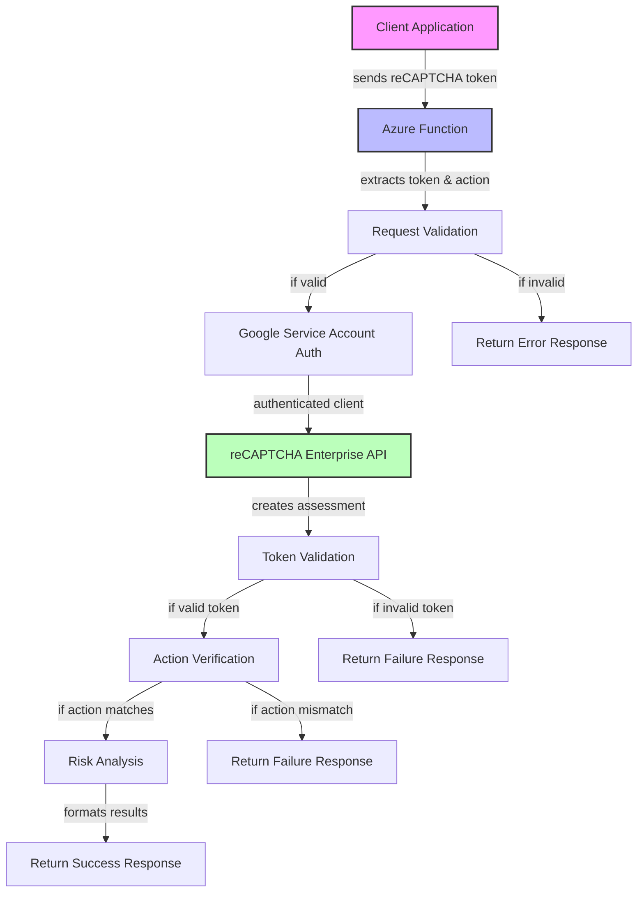

# Architecture Diagram

## System Components

### Client Side
- Web/mobile application implements reCAPTCHA Enterprise
- Client generates a token upon user interaction
- Token and action name sent to Azure Function

### Azure Function
- Serverless HTTP endpoint receives token verification requests
- Authenticates with Google Cloud using service account
- Communicates with reCAPTCHA Enterprise API
- Processes risk assessment responses
- Returns structured API responses

### Google reCAPTCHA Enterprise
- Validates tokens against expected actions
- Performs risk analysis using machine learning
- Provides fraud detection scores and risk reasons

## Data Flow

1. User interacts with protected element on client application
2. Client-side reCAPTCHA generates a token
3. Application sends token to Azure Function endpoint
4. Function authenticates with Google Cloud
5. Function creates assessment request with token
6. Google reCAPTCHA Enterprise evaluates the token
7. Assessment results returned with risk score and reasons
8. Function formats and returns API response to client
9. Client application takes appropriate action based on risk score